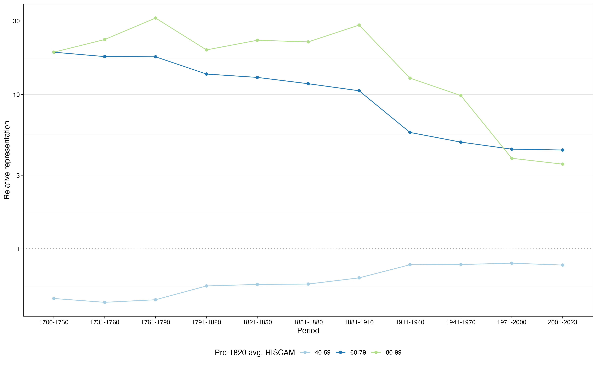
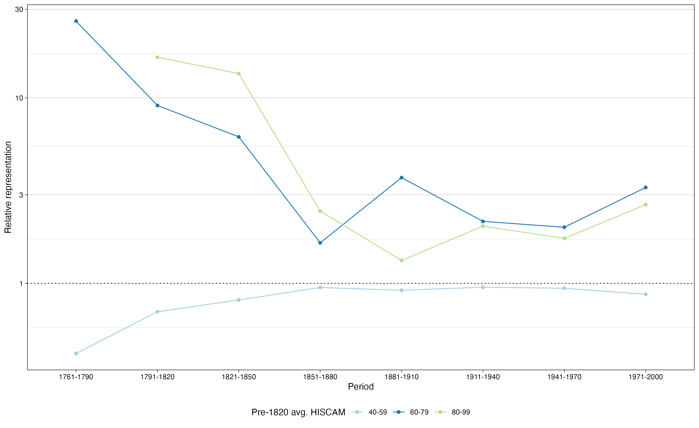
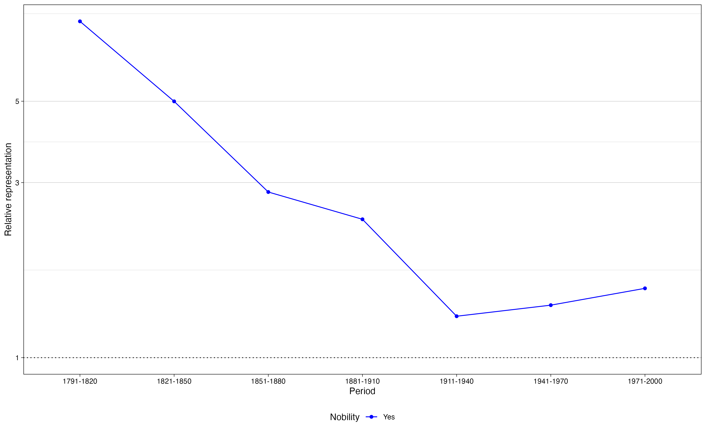
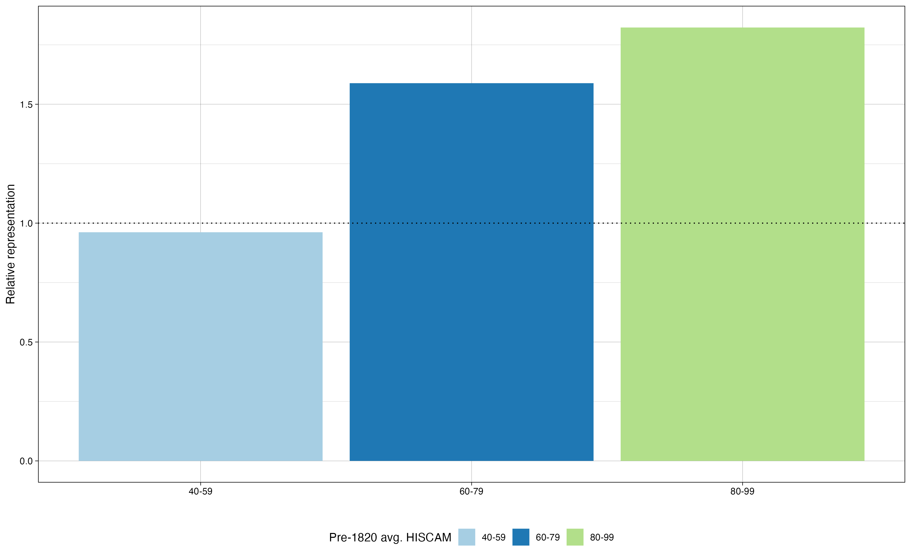
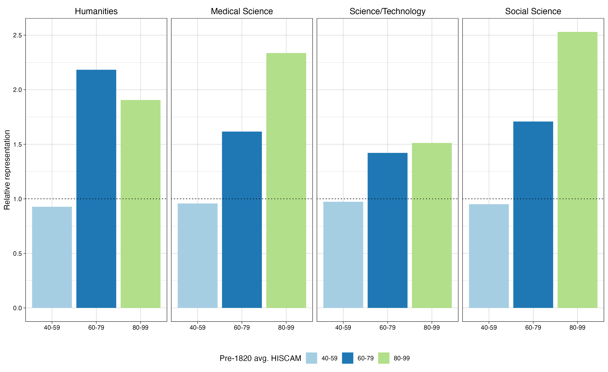

---
output:
  xaringan::moon_reader:
    includes:
      after_body: insert-logo.html
    self_contained: false
    lib_dir: libs
    nature:
      theme: flatly
      highlightStyle: tango
      highlightLines: true
      countIncrementalSlides: false
      ratio: '16:9'
editor_options: 
  chunk_output_type: console
---
class: center, inverse

<style>
ul {
  margin-bottom: 20px; /* Adjust space below each list */
}
li {
  margin-bottom: 10px; /* Adjust space between items */
}
</style>

```{r xaringan-panelset, echo=FALSE}
xaringanExtra::use_panelset()
```

```{r xaringan-tile-view, echo=FALSE}
xaringanExtra::use_tile_view()
```

```{r xaringanExtra, echo = FALSE}
xaringanExtra::use_progress_bar(color = "#808080", location = "top")
```

```{css echo=FALSE}
.pull-left {
  float: left;
  width: 48%;
}
.pull-right {
  float: right;
  width: 48%;
}
.pull-right ~ p {
  clear: both;
}

.pull-left-wide {
  float: left;
  width: 66%;
}
.pull-right-wide {
  float: right;
  width: 66%;
}
.pull-right-wide ~ p {
  clear: both;
}

.pull-left-narrow {
  float: left;
  width: 30%;
}
.pull-right-narrow {
  float: right;
  width: 30%;
}

.tiny123 {
  font-size: 0.40em;
}

.small123 {
  font-size: 0.80em;
}

.large123 {
  font-size: 2em;
}

.huge123 {
  font-size: 4em;
}

.red {
  color: red;
}

.highlight {
  background-color: yellow;
}
```


# Measuring Long-Run Social Mobility in Denmark using Surnames (1700-2024)
## Gregory Clark, Martin Hørlyk Kristensen, and Christian Vedel
## University of Southern Denmark, HEDG
### PhD Status Seminar, `r Sys.Date()`
---

# Introduction: A history of Danish naming laws and traditions

1526: King Frederik I ordered noble families to take on a permanent family name
- Prior to this 85% of noble families already had a permanent family name

<br>

17th/18th century: the bourgeoisie are increasingly selecting out of primary patronyms into permanent names
- Most frequent family names of the time: geographical- and occupational surnames
- The Germanic influence made individuals select German variant of their surname (e.g. Schandorff instead of Skanderup, Schröder instead of Skrædder (tailor)).

---

# Introduction: A history of Danish naming laws and traditions

The tradition of using primary patronyms was kept alive by peasants
- Could be difficult to trace down e.g. *Hans Pedersen* in a village
- Solution: adopt additional surname based on occupation (e.g. Smed), physical appearance (e.g. Grå), or terrain (e.g. Bjerg, Bakke)

<br>

1828: Free choice to decide on a surname for newborn children
* A majority of peasants stuck with a primary patronym

<br>

1856: Abolition of free choice

<br>

Towards the end of the 19th century and in the 20th century name-changing laws were enacted, allowing citizens to change surnames

???

Informal naming tradition was recognized among peasants. But authorities had difficulties finding e.g. *Hans Bakke Pedersen* since he was likely recorded as *Hans Pedersen*

---

# Methodology

Traditional studies on intergenerational mobility utilizing parent-child correlations in education or income usually find high levels of mobility.

$$y_{i, child} = \alpha + \beta y_{i,parent} + \varepsilon_i$$
- For Scandinavia $\beta$ is in the range of 0.12 - 0.27 for income, and $\beta$ in the range of 0.30 - 0.40 for education (Stuhler, 2018)

Parent-child correlations may understate transmission
- Transmission of latent factors
- Measurement error

Alternative approaches:
- Utilize horizontal kinship and account for latent transmission (Collado et al, 2023)
- Surnames (Clark and Cummins, 2014; Clark, 2014)

This project aims at estimating long-run social mobility in Denmark utilizing surnames

---

# Methodology

We measure social status of surname group $z$ as:

$$Relative \ representation \ of \ z =  \frac{Fraction \ of \ surname \ type \ z \ in \ elite \ group}{Fraction \ of \ surname \ type \ z \ in \ population}$$

What could a surname type $z$ be?
- Aristocratic surnames
- Different groupings based on average pre-1820 HISCAM score
- "..sen" or "..datter"
- Latinized surnames

---

# Methodology

What could an elite group be?
- Owners of manor estates
- Members of parliament
- Lawyers
- Doctors
- PhD graduates

<br>

We could also consider less elite groups:
- Master students
- Nurses

<br>

... and perhaps even lower-status groups:
- Prisoners

???
Database covering inmates 1752-1932:
* https://banditter.dk/

---

# Data

Distribution of surnames is constructed using three different sources:

- Census data
  - With HISCO codes thanks to OccCANINE (Dahl, Johansen, and Vedel, 2024)
  
- Cemetery data from Dk-gravsten
  - Database compiled by amateur genealogists

- Surname frequencies

<br>

```{r, echo = F, message = F, warning = F, fig.width=10, fig.height=5}
library(tidyverse)

census = read.csv("/Users/mhkr/Library/CloudStorage/Dropbox/DanishMobility/Data/population/census_count.csv")
cemetery = read.csv("/Users/mhkr/Library/CloudStorage/Dropbox/DanishMobility/Data/population/cemetery/cemetery_count.csv")
dst = read.csv("/Users/mhkr/Library/CloudStorage/Dropbox/DanishMobility/Data/population/pop2002_2023/dst_count.csv")

census = census %>% filter(year>=1700 & year<=1901)

summary_statistics_pop = rbind(
  cbind("Source", "N", "Start", "End"),
  cbind("Census", format(sum(census$n), big.mark = ","), min(census$year, na.rm = T), max(census$year, na.rm = T)),
  cbind("Cemetery", format(sum(cemetery$n), big.mark = ","), 1475, max(cemetery$year, na.rm = T)), # note: 1475 seems to be the latest year with a valid observation; years preceding this seems to be typos (adjust later!)
  cbind("DST", format(sum(dst$n), big.mark = ","), min(dst$year, na.rm = T), max(dst$year, na.rm = T))
)

knitr::kable(summary_statistics_pop, align = c("l", "c", "c", "c"), format = "html")

```

---

# Data

As of now, we have gathered surnames in the following elite groups:
- Members of parliament using Danish Legislators Database (Klint et al, 2023)
- Owners of manor estates from The Danish Research Centre for Manorial Studies
- PhD graduates who have handed in their dissertation between 2011 and 2023 from Research Portal Denmark

<br>

```{r, echo = F, message = F, warning = F, fig.width=10, fig.height=5}
library(readxl)

dld = readRDS("/Users/mhkr/Library/CloudStorage/Dropbox/DanishMobility/Data/elite/DLD/member1849-2022.Rds")
manor = read.csv("/Users/mhkr/Library/CloudStorage/Dropbox/DanishMobility/Data/elite/manor_owners_cleaned.csv")
phd = read_xlsx("/Users/mhkr/Downloads/dki-export-94266.xlsx")

manor$yearFrom[manor$estateName=="kærgaard" & manor$yearFrom==1161] <- NA # yearFrom for this observation is a typo

summary_statistics_elite = rbind(
cbind("Source", "N", "Start", "End"),
cbind("DLD", format(nrow(dld), big.mark = ","), min(dld$bYear, na.rm = T), max(dld$bYear, na.rm = T)),
cbind("Owners of manor estates", format(nrow(manor), big.mark = ","), min(manor$yearFrom, na.rm = T), max(manor$yearTo, na.rm = T)),
cbind("PhD graduates", format(nrow(phd), big.mark = ","), min(phd$`Submission Year`, na.rm = T), max(phd$`Submission Year`, na.rm = T))
)

knitr::kable(summary_statistics_elite, align = c("l", "c", "c", "c"), format = "html")
```

???

DLD: database of members of Denmark's parliament, Folketinget, for every electoral term since its inception in 1849

Oldest manor estate: Kalundborg Ladegaard
* https://www.danskeherregaarde.dk/nutid/kalundborg-ladegaard

Search page for Dk-gravsten:
* https://dk-gravsten.dk/viewpage.php?page_id=28

---

# Data

Example of surnames by pre-1820 avg. HISCAM score of surname:

```{r, echo = F, message = F, fig.width=8, fig.height=4}
library(tidyverse)

census_pre1820_ses <- read.csv("~/Library/CloudStorage/Dropbox/DanishMobility/Data/population/census_pre1820_count_ses.csv")

surnames_hisco_examples = cbind(
census_pre1820_ses %>% filter(period == "1787-1820" & group == "40-59") %>% arrange(desc(nSES)) %>% slice_head(n = 10) %>% select(surname) %>% mutate(surname = str_to_title(surname)),
census_pre1820_ses %>% filter(period == "1787-1820" & group == "60-79") %>% arrange(desc(nSES)) %>% slice_head(n = 10) %>% select(surname) %>% mutate(surname = str_to_title(surname)),
census_pre1820_ses %>% filter(period == "1787-1820" & group == "80-99") %>% arrange(desc(nSES)) %>% slice_head(n = 10) %>% select(surname) %>% mutate(surname = str_to_title(surname))
) %>% as.data.frame() %>% 
  setNames(c("40-59", "60-79", "80-99"))

knitr::kable(surnames_hisco_examples, align = "c", format = "html", booktabs = T) %>% kableExtra::add_header_above(c("Pre-1820 avg. HISCAM" = 3))
```

???

List of 10 most frequent surnames in different HISCAM groups

---

# Preliminary findings: owners of manor estates

```{r, out.width="70%", echo = F, fig.align="center"}

```

---

# Preliminary findings: owners of manor estates

```{r, out.width="70%", echo = F, fig.align="center"}
knitr::include_graphics("figures/manor_rr_by_nobility.png")
```

---

# Preliminary findings: members of parliament

```{r, out.width="70%", echo = F, fig.align="center"}

```

---

# Preliminary findings: members of parliament

```{r, out.width="70%", echo = F, fig.align="center"}

```

---


# Preliminary findings: PhD graduates (2011-2024)

```{r, out.width="70%", echo = F, fig.align="center"}

```

---

# Preliminary findings: PhD graduates (2011-2024)

```{r, out.width="70%", echo = F, fig.align="center"}

```

---

# Validity of data sources
Both the census data and surname frequencies consider the entire universe of surnames in Denmark

One could question the use of cemetery data as a proxy for surnames, though

```{r, out.width="50%", echo = F, fig.align="center"}
knitr::include_graphics("figures/sen_datter_plot.png")
```

---

# Selection out of patronymic surnames

One concern is that individual select out of patronymic surnames to take on a more distinct surname

Can potentially be tested using church books
- If death records record birth year: trace all individuals who are born in year x and die in year z
- How many are born with patronymic surname vs. how many die with patronymic surname

---

# Potential pathways: occupation-specific surnames

Do occupations run in the family?
- What fraction of individuals take on the occupation associated with their surname?

<br>

```{r, echo = F, message = F, fig.width=6, fig.height=3}
tmp_efternavne = read.csv("/Users/mhkr/Desktop/tmp_efternavne.csv")

tab_occ = 
  tmp_efternavne %>% select(inputs, hisco_1, prob_1, desc_1, hisco_2, prob_2, desc_2)

knitr::kable(tab_occ)
```

<br>

Occupation-specific surnames were sometimes also translated to Latin
- e.g. Smed (*smith*) was translated into Fabricius
- Usually practiced by university students

???
* Examples of occupation-specific surnames:
  * Fischer, Becker (Bager), Schmidt, Schröder

* Translation into Latin surnames is also evident from geography-inspired surnames
  * e.g. Collin (Kolding), Pontoppidan (Broby), Scavenius (Skagen), and Wellejus (Vejle)

* and patronyms:
  * Bartholin (Berthelsen), Jensenius (Jensen), Ægidius (Gjødesen)

---

# Potential pathways: Germanic influence on surnames

How did important historical interactions with Germany influence the uptake of Germanic-sounding/influenced surnames?

